Ejercicio práctico sobre la utilización avanzada de Git, GitHub y Markdown
==================================================

- Alumno: **Juan Antonio García Cuevas**
- Fecha.: 16/05/2016


Notas
==================================================

>1. Este ejercicio es continuación del anterior por lo que tendréis que seguir trabajando en el repositorio campusciff.
>2. También tendreís que ir poniendo los comandos que habéis tenido que utilizar durante todos los ejercicios y las explicaciones y capturas de pantalla que consideréis necesarias al fichero README.md del citado repositorio.

Crear una rama v0.2
==================================================

#### 1. Crear una rama **v0.2**.

*Desde línea de comandos*:

```bash
    git branch v0.2
```

#### 2. Posiciona tu carpeta de trabajo en esta rama.

*Desde línea de comandos*:

```bash
    git checkout v0.2
```

Añadir fichero 2.txt
==================================================

#### 1. Añadir un fichero **2.txt** en la rama **v0.2**.

*Desde línea de comandos*:

```bash
    echo "Fichero 2" > 2.txt
```

Crear rama remota v0.2
==================================================

#### 1. Subir los cambios al reposiorio remoto.

*Desde línea de comandos*:

```bash
    git add -A
    git commit -m "Se añade el fichero 2.txt a la rama v2.0"
    git push
```

Merge directo
==================================================

#### 1. Posicionarse en la rama **master**.

*Desde línea de comandos*:

```bash
    git checkout master
```

#### 2. Hacer un merge de la rama **v0.2** en la rama **master**.

*Desde línea de comandos*:

```bash
    git merge v0.2 -m "Se hace merge de la rama v0.2 en master"
```

Merge con conflicto
==================================================

#### 1. En la rama **master** poner **Hola** en el fichero **1.txt** y hacer commit.

*Desde línea de comandos*:

```bash
    git checkout master
    echo "Hola" >> 1.txt
	git add -A
	git commit -m "Se añade 'Hola' al fichero 1.txt desde la rama master"
```

#### 2. Posicionarse en la rama **v0.2** y poner **Adios** en el fichero "1.txt" y hacer commit.

*Desde línea de comandos*:

```bash
    git checkout v0.2
    echo "Adios" >> 1.txt
	git add -A
	git commit -m "Se añade 'Adios' al fichero 1.txt desde la rama v0.2"
```

#### 3. Posicionarse de nuevo en la rama **master** y hacer un merge con la rama **v0.2**

*Desde línea de comandos*:

```bash
    git checkout master
    git merge v0.2 -m "Se hace un nuevo merge de la rama v0.2 en master, con errores"
```


Listado de ramas
==================================================

#### 1. Listar las ramas con merge y las ramas sin merge.

*Desde línea de comandos*:

```bash
    git branch --merged
    git branch --no-merged
```
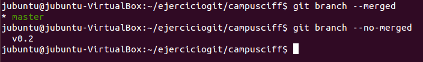

Arreglar conflicto
==================================================

#### 1. Arreglar el conflicto anterior y hacer un commit.

*Primero editamos el fichero "**1.txt**" y hacemos las correcciones pertinentes. Después, desde línea de comandos*:

```bash
    git add -A
    git commit -m "Subimos las correcciones al merge fallido"
```
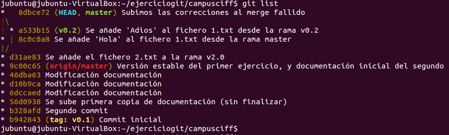

Borrar rama
==================================================

#### 1. Crear un tag **v0.2**

*Desde línea de comandos*:

```bash
    git tag v0.2 -m "Asignando versión v0.2 a la rama principal"
```

#### 2. Borrar la rama **v0.2**

*Desde línea de comandos*:

```bash
    git branch -d v0.2
```

Listado de cambios
==================================================

#### 1. Listar los distintos commits con sus ramas y sus tags.

*Desde línea de comandos*:

```bash
    git list
```

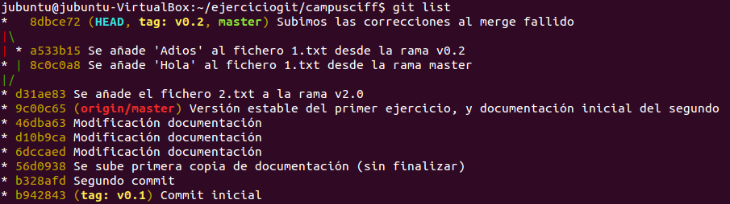

Crear una organización
==================================================

#### 1. Crear una organización llamada **campusciff-tunombredeusuariodegithub**

*Desde un navegador web*:

1. En el menú desplegable "**+**" situado en la parte superior derecha de la pantalla seleccionar "**New organization**".
1. Introducir "**campusciff-juangarciaciff**" en el cuadro de texto "**Organization name**".
1. Introducir "**juangarcia@campusciff.net**" en el cuadro de texto "**Billing email**".
1. Pulsar sobre el botón "**Create organization**". 
1. En la nueva pantalla pulsar "**Finish**". 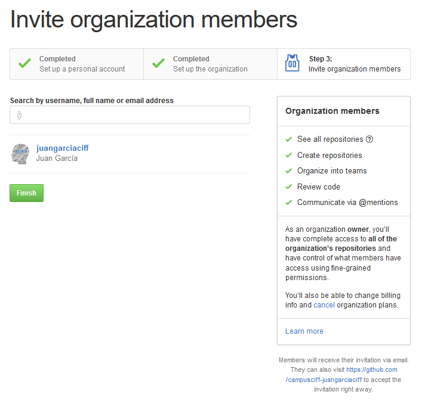

Crear equipos
==================================================

#### 1. Crear 2 equipos en la organización **campusciff-tunombredeusuariodegithub**, uno llamado **administradores** con más permisos y otro **colaboradores** con menos permisos.

*Desde un navegador web*:

1. Navegar hasta la página de la organización recién creada y acceder al tab "**Teams**"; se abrirá una pantalla nueva, en la que hay que pulsar sobre el botón "**Create a new team**". 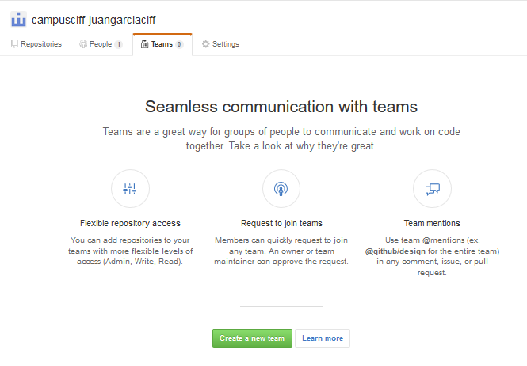
1. En el campo "**Team name**" del formulario introducir "**administradores**" y pulsar el botón "**Create team**". 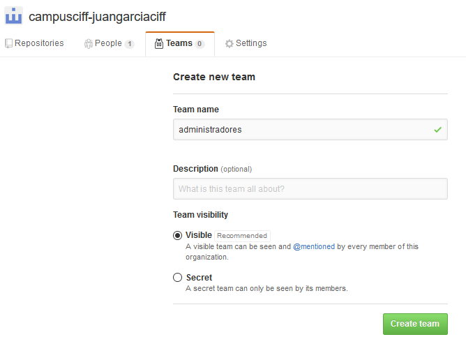
1. Seleccionar el equipo "**administradores**" y pulsar en el botón "**Settings**". Se abre una nueva pantalla en la que hay que pulsar el tab "**Settings**". Luego en la opción de menú "**Members privileges**". Allí, seleccionar el permiso "**Admin**" y pulsar el botón "**Save**". 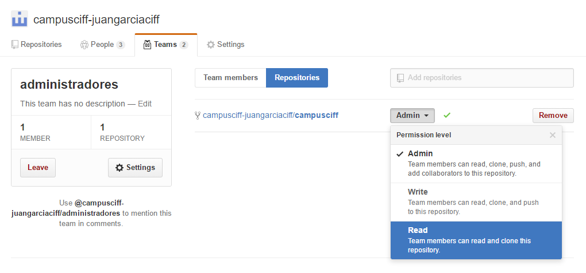
1. Repetir la operación para crear el equipo de "**colaboradores**", pero esta vez asignando el permiso "**Write**".

#### 2. Meter a github.com/asanzdiego y a 2 de vuestros compañeros de clase en el equipo **administradores**.

*Desde un navegador web*:

1. Navegar hasta la página del equipo "**administradores**" la organización recién creada. En el cuadro de texto "**Add a person**" ir buscando y añadiendo los miembros que se desee incorporar al equipo. 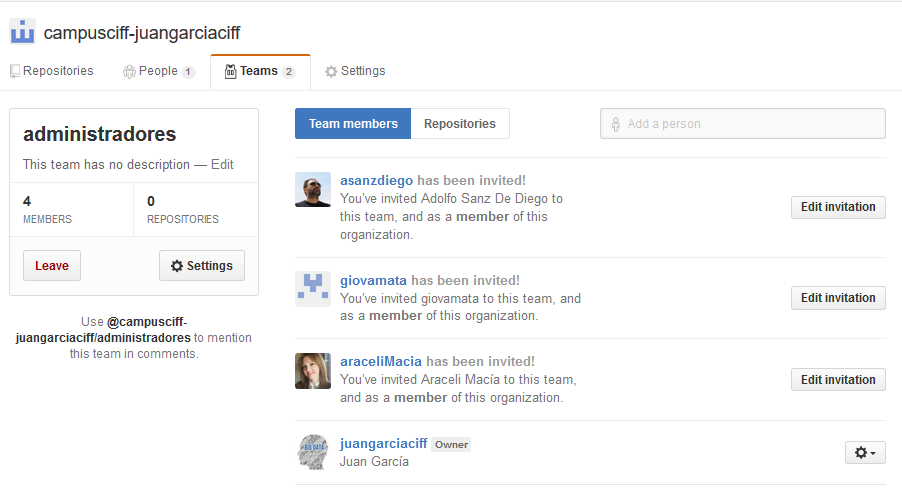

#### 3. Meter a github.com/asanzdiego y a otros 2 de vuestros compañeros de clase en el equipo **colaboradores**.

1. Repetir la operación anterior para añadir miembros al equipo "**colaboradores**".

Crear un index.html
==================================================

#### 1. Crear un index.html que se pueda ver como página web en la organización.

*Desde un navegador web*:

1. Navegamos hasta la página de la organización "**campusciff-juangarciaciff**" y pulsamos en el botón "**Create a new repository**". 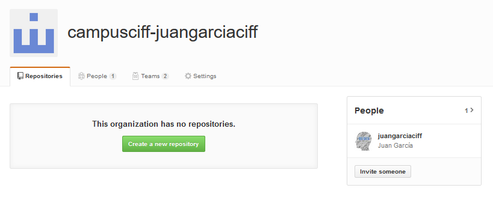
1. En el cuadro de texto "**Repository name**" escribimos el nombre del repositorio, que debe ser, obligatoriamente, el nombre de la organización seguido de "**.github.io**": "**campusciff-juangarciaciff.github.io**". Luego pulsamos el botón "**Create repository**". 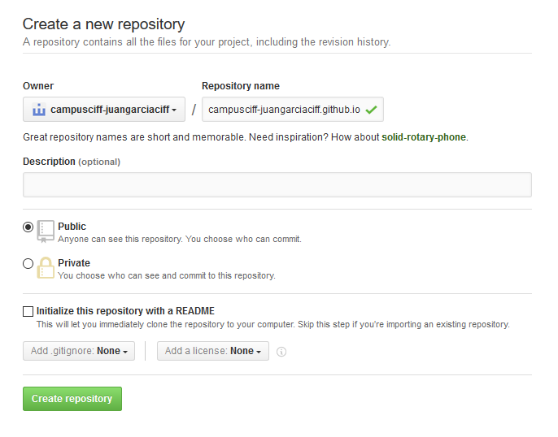
1. En la página de repositorio que aparece, pulsamos en el tab "**Settings**". 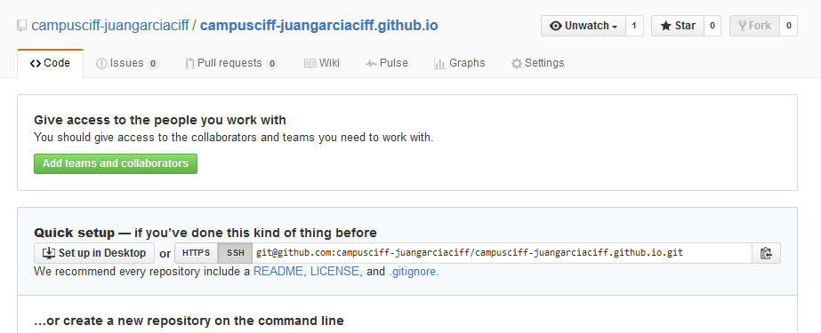
1. En la página de configuración del repositorio pulsamos el botón "**Launch automatic page generator**". 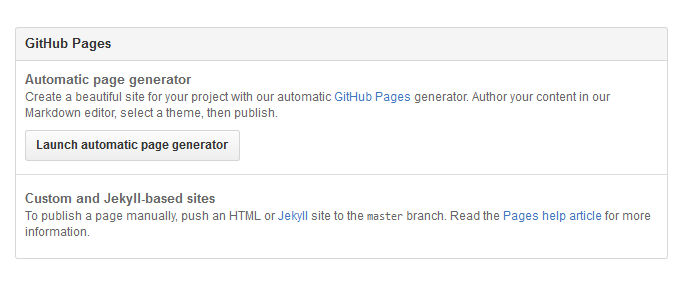
1. En la nueva página podemos modificar el contenido de la página HTML en el campo "**Body**", empleando sintaxis Makdown, añadiendo al inicio el siguiente código:
```
    ### Página inicial de la organización
    **Creada por Juan Antonio  García Cuevas el 18 de mayo de 2016**
    
```
 

    6. Después pulsamos el botón "**Continue to layouts**" que nos redirige a la página web, donde podemos cambiar el tema o estilo. Luego pulsamos el botón "**Publish page**". 
. Con esto hemos terminado de crear la página index.html, con el archivo "**params.json**" y directorio "**stylesheets**" adicionales. 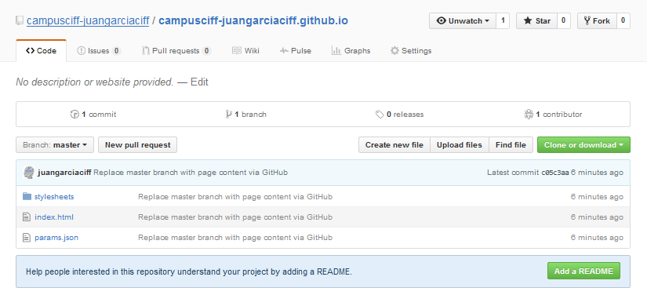
    7. Ahora, ya podemos acceder directamente con la siguiente url, formada únicamente por "http://" seguido del nombre de la organización:
```html
    http://campusciff-juangarciaciff.github.io/
```
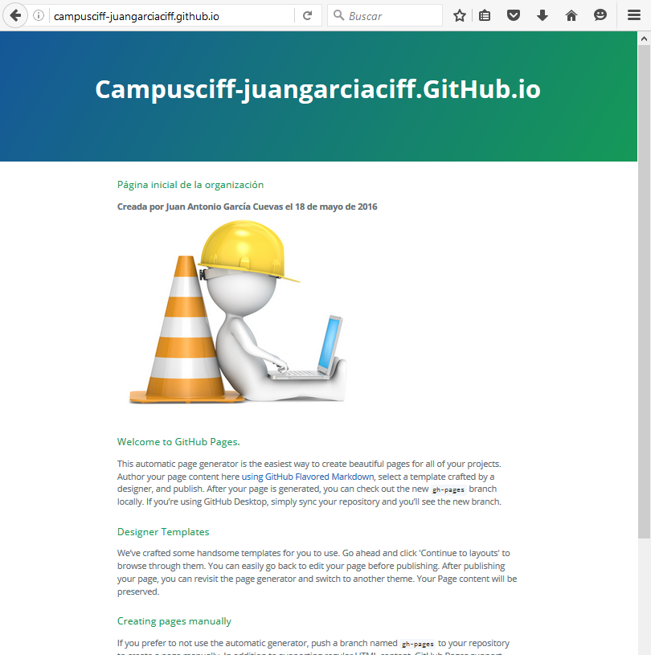

Crear Pull-requests
==================================================

#### 1. Hacer 2 forks de 2 repositorios **campusciff-tunombredeusuariodegithub.github.io** de 2 organizaciones de las que no seais ni administradiores ni colaboradores.

#### 2. Crearos una rama en cada fork.

#### 3. En cada rama modificar el fichero **index.html** añadiendo vuestro nombre.

#### 4. Con cada rama hacer un pull-request.

Gestionar Pull-requests
==================================================

#### 1. Aceptar los pull-request que lleguen a los repositorios de tu organización.
