Ejercicio práctico sobre la utilización básica de Git, GitHub y Markdown 
==================================================

- Alumno: **Juan Antonio García Cuevas**
- Fecha.: 16/05/2016


Repositorio campusciff
==================================================

#### 1. Crear un repositorio en vuestro GitHub llamado *campusciff*.

*Desde un navegador web*:

1. Acceder al sitio web de **GitHub** y logarse con usuario y contraseña: <https://github.com/>.
1. Acceder a la página "**Create a new repository**" a través de la opción "**New repository**" del menú desplegable "**+**" situado en la parte superior derecha de la pantalla.
1. Escribir el nombre del repositorio (**campusciff**) en el cuadro de texto "**Repository name**" y pulsar "**Create repository**". 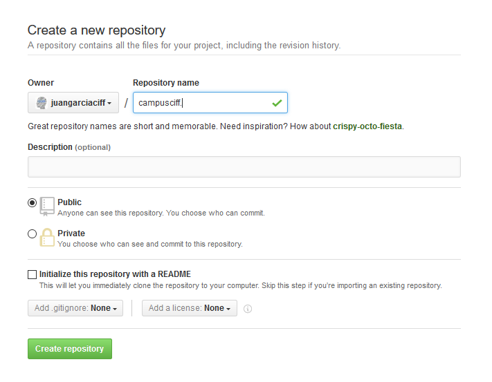

#### 2. Clonar vuestro repositorio en local. 

*Desde línea de comandos*:

```bash
    git clone git@github.com:juangarciaciff/campusciff.git
```

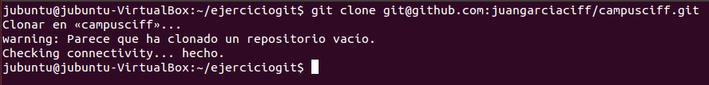

README
==================================================

#### 1. Crear (si no lo habéis creado ya) en vuestro repositorio local un documento README.md. 

*Desde línea de comandos*:

```bash
    cd campusciff
	echo "" > README.md 
```

> Notas: en este documento tendreis que ir poniendo los **comandos** que habéis tenido que utilizar durante todos los ejercicios y las **explicaciones y capturas de pantalla** que consideréis **necesarias**.

Commit inicial
==================================================

#### 1. Añadir al README.md los comandos utilizados hasta ahora y hacer un commit inicial con el mensaje commit inicial. 

*Desde el escritorio de Ubuntu*:

- Editar y modificar el archivo README.md.

*Desde línea de comandos*:

```bash
	git add README.md
	git commit -m "Commit inicial"
```

Push inicial
==================================================

#### 1. Subir los cambios al repositorio remoto.

*Desde línea de comandos*:

```bash
	git push origin master
```
	
Ignorar archivos
==================================================

#### 1. Crear en el repositorio local un fichero llamado privado.txt.

*Desde línea de comandos*:

```bash
	echo "" > privado.txt
```

#### 2. Crear en el repositorio local una carpeta llamada privada. 

*Desde línea de comandos*:
	
```bash
	mkdir privada
```

#### 3. Realizar los cambios oportunos para que tanto el archivo como la carpeta sean ignorados por git. 

*Desde línea de comandos*:

```bash
	echo "*~" > .gitignore
	echo "privado.txt" > .gitignore
	echo "privada/*" > .gitignore
```

> Nota: he añadido "*~"

Añadir fichero 1.txt
==================================================

#### 1. Añadir fichero 1.txt al repositorio local.

*Desde línea de comandos*:

```bash
	echo "Este es el fichero 1" > 1.txt
```

Crear el tag v0.1
==================================================

#### 1. Crear un tag v0.1.

*Desde línea de comandos*:

```bash
	git tag v0.1
```

Subir el tag v0.1
==================================================

#### 1. Subir los cambios al repositorio remoto.

*Desde línea de comandos*:

```bash
	git add .gitignore
	git add 1.txt
	git commit -m "Segundo commit"
	git push origin master
```

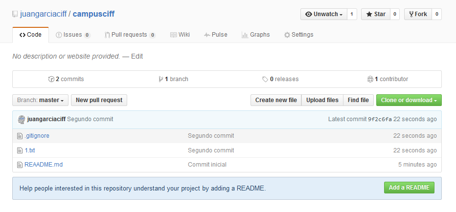

Cuenta de GitHub
==================================================

#### 1. Poner una foto en vuestro perfil de GitHub. 

*Desde un navegador web*:

1. Desde el menú desplegable de la esquina superior derecha de la pantalla seleccionar la opción "**Setting**"
1. En la nueva pantalla pulsar sobe el botón "**Upload new picture**", elegir una imagen de nuestro sistema y pulsar "**Update profile**". 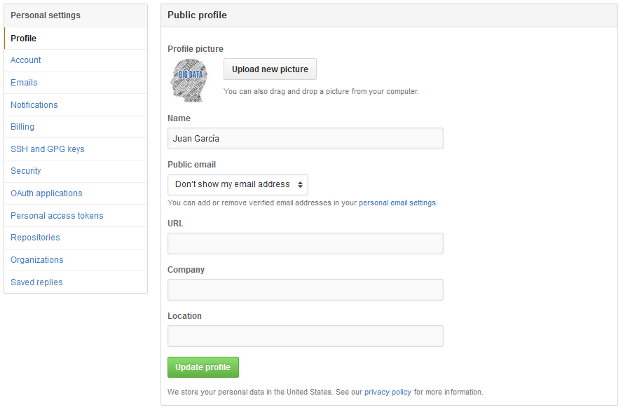

#### 2. Poner el doble factor de autentificación en vuestra cuenta de GitHub.

*Desde un navegador web*:

1. Desde el menú desplegable de la esquina superior derecha de la pantalla seleccionar la opción "**Setting**"
1. Pulsar sobre la opción "**Security**" del menú:. 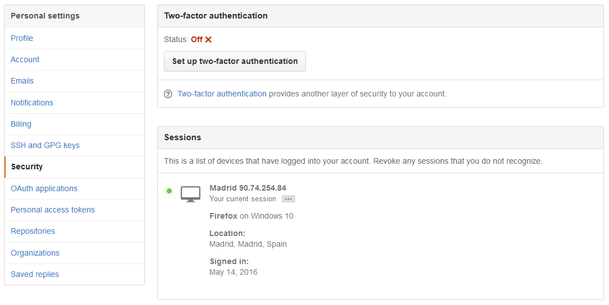
1. Pulsar sobre el botón "**Set up two-factor authentication**". 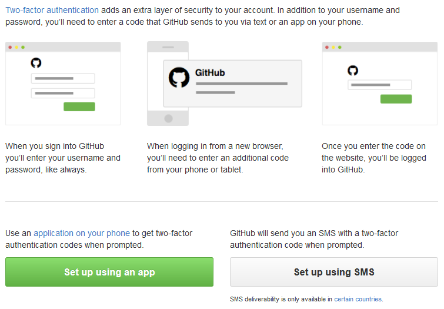
1. Seleccionar una de las opciones, rellenar los datos y seguir las intrucciones. En la imagen siguiente se muestra el formulario que aparece después de haber pulsado sobre el botón "**Set up using SMS**". 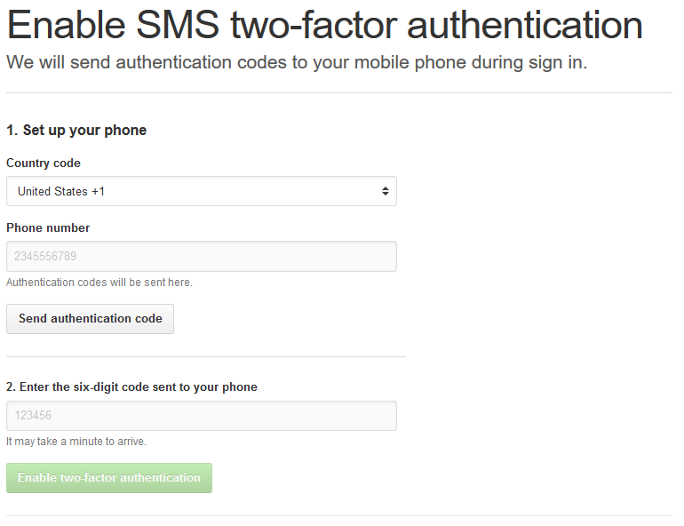

#### 3. Añadir (si no lo habéis hecho ya) la clave pública que se corresponde a tu ordenador. 

*Desde línea de comandos*:

```bash
    ls -al ~/.ssh                                            #Comprobar si existen claves SSH
    ssh-keygen -t rsa -b 4096 -C "juangarcia@campusciff.net" #Generar una nueva clave SSH
    eval "$(ssh-agent -s)"                                   #Asegurar que el agente SSH está activo
    ssh-add ~/.ssh/id_rsa                                    #Añadir la clave SSH al agente SSH
    cat ~/.ssh/id_rsa.pub                                    #Copiar fichero al portapapeles
```

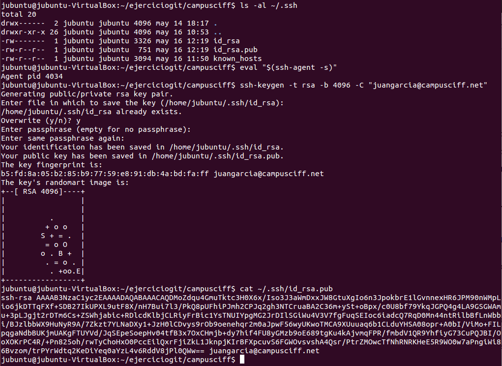

*Desde un navegador web*:

1. Acceder a la página "**SSH and GPG keys**" desde el menú principal y pulsar sobre el botón "**New SSH key**". 
1. Añadir título y pegar el contenido del portapapeles (fichero *id_rsa.pub*). 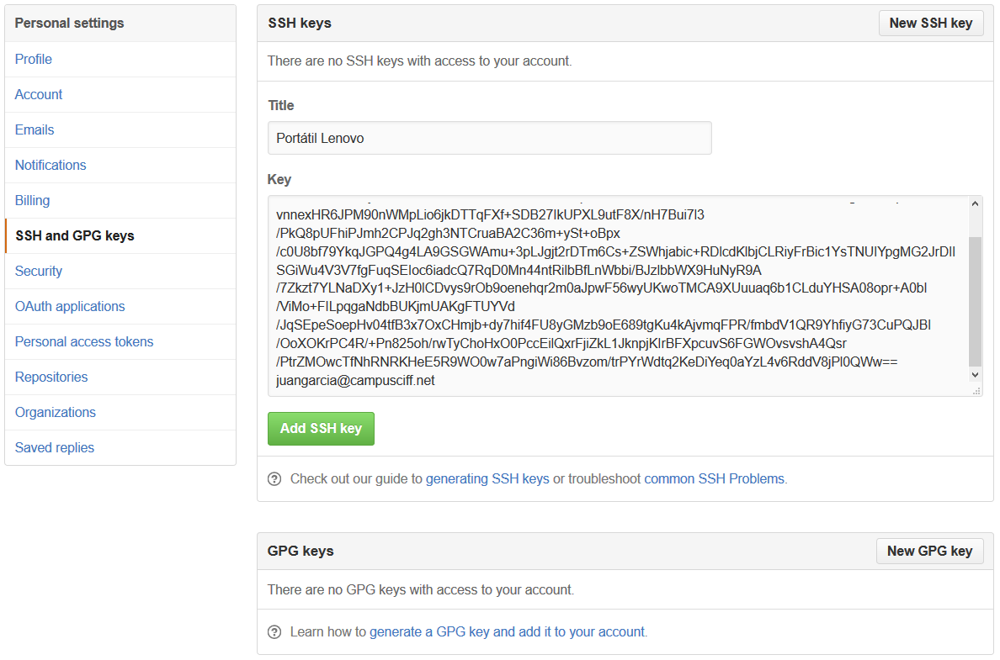
1. Pulsar el botón "**Add SSH key**". 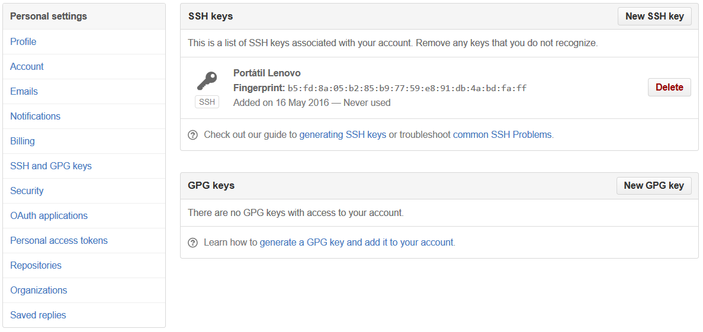

Uso social de GitHub
==================================================

#### 1. Preguntar los nombres de usuario de GitHub de tus compañeros de clase, búscalos, y síguelos. 

*Desde un navegador web*:

1. Desde el menú desplegable de la esquina superior derecha de la pantalla seleccionar la opción "**Explore**".
1. En el cuadro de texto de la parte superior de la nueva pantalla escribir el nombre de usuario de un compañero y pusar la tecla Return. 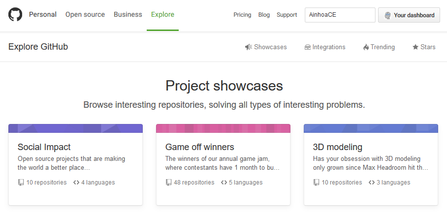
1. Aparecerá una nueva pantalla con la lista de elementos de GitHub que corresponden al texto escrito. Pulsar sobre la opción "**Users**" del menú, localizar la persona buscada y pulsar sobre el botón "**Follow**" correspondiente. 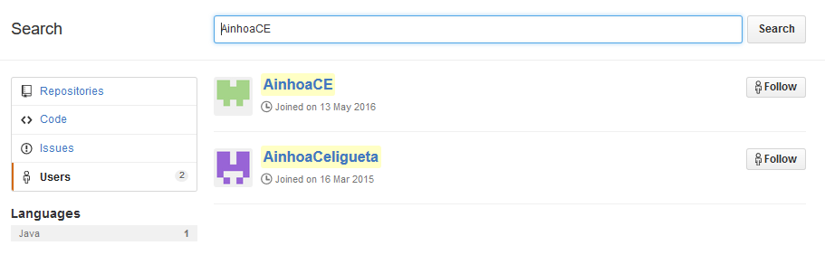
1. En la pantalla "Following" pueden verse los compañreros a los que se está siguiendo. 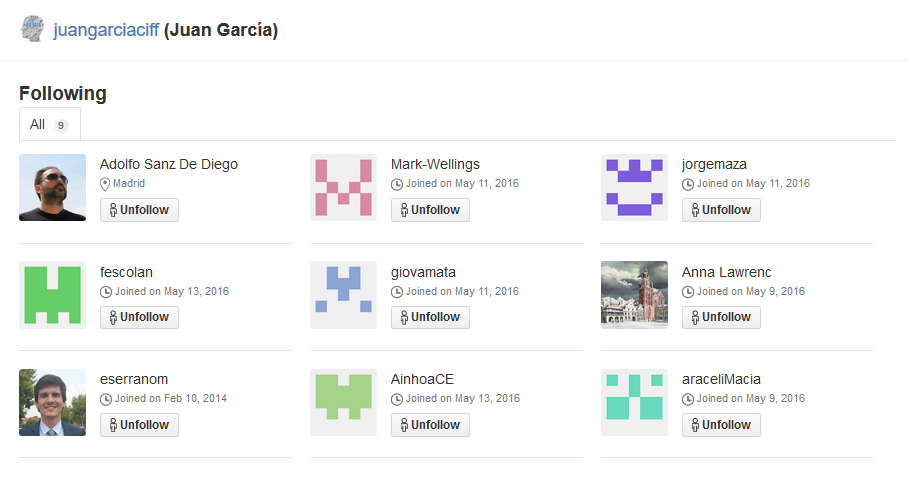

#### 2. Seguir los repositorios campusciff del resto de tus compañeros. 

*Desde un navegador web*:

1. Acceder a la página GitHub de un compañero (Ej.: _https://github.com/eserranom_) y pulsar sobre el nombre del repositorio "**campusciff**".
1. En la pantalla del repositorio pulsar sobre el botón "**Watch**" y seleccionar la opción "**Watching**". 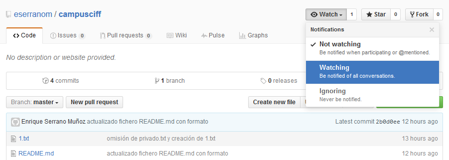

#### 3. Añadir una estrella a los repositorios campusciff del resto de tus compañeros. 

*Desde un navegador web*:

1. Acceder a la página GitHub de un compañero (Ej.: _https://github.com/eserranom_) y pulsar sobre el nombre del repositorio "**campusciff**".
1. En la pantalla del repositorio pulsar sobre el botón "**Star**". 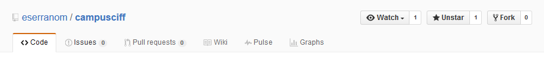

Crear una tabla
==================================================

#### 1. Crear una tabla de este estilo en el fichero README.md con la información de varios de tus compañeros de clase:

| NOMBRE                          | GITHUB            |
| ------------------------------- | ----------------- |
| Ainhoa Calvo                    | [AinhoaCE](https://github.com/AinhoaCE)          |
| Alberto Marino                  |                   |
| Anna Lawrenc                    | [annalawrenc](https://github.com/annalawrenc)       |
| Araceli Macia Barrado           | [araceliMacia](https://github.com/araceliMacia)      |
| Asier Matas Hernando            |                   |
| Borja Méndez Mariño             |                   |
| Edwin Giovanni Gonzalez Mata    | [giovamata](https://github.com/giovamata)         |
| Enrique Serrano Muñoz           | [eserranom](https://github.com/eserranom)         |
| Fernando Javier Escolano Cuenca | [fescolan](https://github.com/fescolan)          |
| Héctor Soto                     |                   |
| Jorge Maza de Julián            | [jorgemaza](https://github.com/jorgemaza)         |
| José Luis González Blázquez     |                   |
| Juan Antonio García Cuevas      | [juangarciaciff](https://github.com/juangarciaciff)    |
| Juan Isidro Rodríguez Granados  |                   |
| Mark Wellings                   | [Mark-Wellings](https://github.com/Mark-Wellings)     |
| Sergio Castro Rodriguez         |                   |

Colaboradores
==================================================

#### 1. Poner a github.com/asanzdiego como colaborador del repositorio campusciff

*Desde un navegador web*:

1. Acceder al la página principal del repositorio **campusciff**.
1. Acceder a la pestaña "**Settings**".
1. Acceder a la opción de menú "**Collaborators**".
1. Escribir (o buscar) "**asanzdiego**" en el cuadro de texto "**Search by username, full name or email address**". 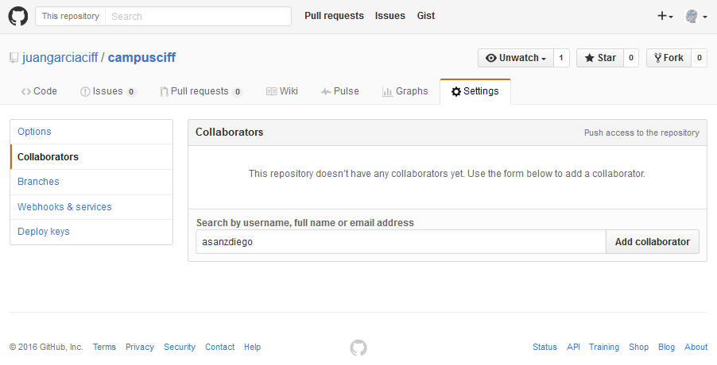
1. Pulsar el botón "**Add collaborator**". 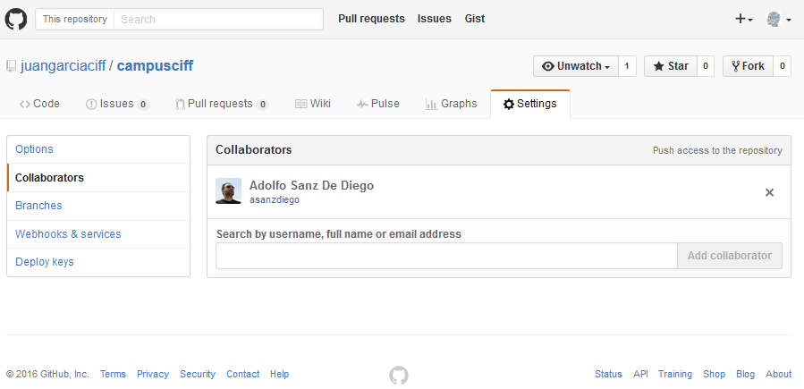

:+1:

